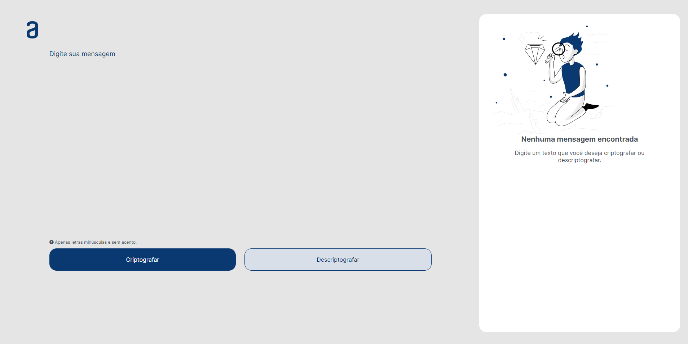

# 
# ✅ Challenge Oracle ONE Alura - Decodificador de texto com Javascript ✅

Challenge Oracle ONE Alura  é um sistema de criptografar e descriptografar mensagens de textos com Javascript. A regra para criptografar as mensagens, segue o modelo de substituir as vogais por determinadas palavras, e para descriptografar é apenas substituir a palavra pela vogal correspondente.

### Regras para criptografar, as "chaves" utilizadas são:

* A letra "e" é convertida para "enter";
* A letra "i" é convertida para "imes";
* A letra "a" é convertida para "ai";
* A letra "o" é convertida para "ober";
* A letra "u" é convertida para "ufat".

# ✨ Overview do projeto✨

🚀__O Challenge__ 🚀

Os usuarios serão capazes de:

* Criptografar as mensagens
* Descriptografar as mensagens
#
📷__Screenshot__ 📷

# ⌨️ Tech usadas ⌨️

* HTML
* CSS
* JavaScript

# 🕹️ Autor  🕹️

** 🕹️ [DevDuart](https://www.linkedin.com/in/walysson-duarte-56926471/)**
